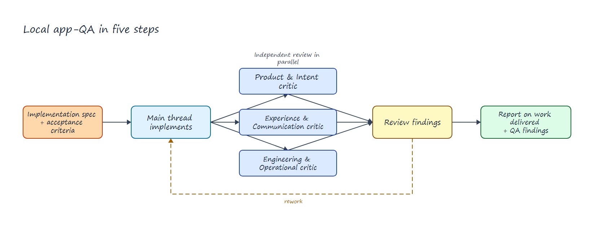

# App QA for Codex

[](LICENSE)
[](skills/app-qa/SKILL.md)

App QA is a Codex plugin for the final review of an app, site, dashboard, page, or interactive product feature.

It addresses a common limitation in agent workflows. The thread that builds an artifact can miss the same assumptions during self-review. App QA separates implementation from three independent review perspectives. The main task still owns every decision and file change.



The editable Excalidraw source for this workflow is in [examples/app-qa-workflow.excalidraw](examples/app-qa-workflow.excalidraw).

## What it does

- Runs exactly three independent, read-only critics.
- Reviews product intent, user experience, and engineering quality.
- Requires observable evidence for each finding.
- Makes the main task accept, reject, or defer every finding.
- Returns re-checks to the original critic tasks after rework.
- Saves the full review in `app-qa-findings.md`.
- Keeps the final response short and useful.

## Install

Add the Codex Toolbox marketplace, then install App QA:

```bash
codex plugin marketplace add Hector-Touza/codex-toolbox --ref main
codex plugin add app-qa@codex-toolbox
```

Or ask Codex:

```text
Install App QA from https://github.com/Hector-Touza/codex-toolbox.
Preserve my existing marketplaces. Confirm that the app-qa skill is available.
Tell me to start a fresh top-level task before I use it.
```

## Use

Open a fresh top-level Codex task in the repository that contains the app. Include App QA in the implementation request:

```text
Implement the requested app and its acceptance criteria. Validate the result with app-qa.
```

You can also invoke the bundled skill explicitly as `$app-qa`.

App QA stops with `APP_QA_REQUIRES_FIRST_CLASS_THREAD` if you start it from a delegated or nested task. This is an execution requirement. The three critics must be direct children of the task that owns the implementation.

## Review roles

| Critic | Focus |
| --- | --- |
| Product & Intent | Requirements, target-user value, scope, assumptions, and product coherence. |
| Experience & Communication | Usability, visual hierarchy, copy, accessibility, responsive behavior, and important interface states. |
| Engineering & Operational | Architecture, state and data integrity, errors, runtime behavior, performance, security, regressions, and focused checks. |

Critics do not edit files. The main task consolidates their findings, implements accepted changes, runs final checks, and writes the report.

## Finding lifecycle

Each finding has an ID, severity, evidence, quality expectation, recommended direction, and confidence. The main task assigns one disposition:

- **Accept**: implement it now.
- **Reject**: explain why the evidence or recommendation does not improve the stated goal.
- **Defer**: record a useful change that is outside the current scope.

App QA uses at most two rework and re-check cycles unless the user asks for more.

## Requirements and limitations

- Use a Codex surface that supports first-class tasks and direct child agents.
- Run the workflow from the top-level task that implements and edits the artifact.
- Make visual apps available for rendered inspection. Source review alone is not enough for the experience critic.
- Expect the workflow to use more time and tokens than a single-thread review.
- Treat the findings as independent review, not formal verification, certification, or proof of production readiness.

## Origin

App QA was developed and forward-tested during the SOMA app workflow. That run used three direct critics, main-task adjudication and rework, re-checks in the original critic tasks, and a persistent findings report.

## License

[MIT](LICENSE) © 2026 Hector Touza.
