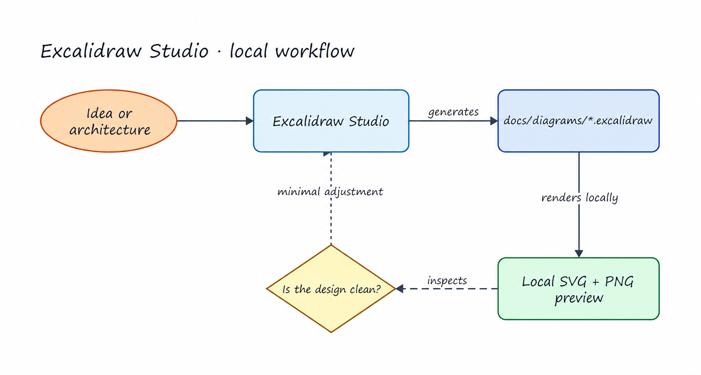

# Excalidraw Studio for Codex

[](LICENSE)
[](https://www.python.org/)
[](#local-first-by-design)

Excalidraw Studio is a local-first Codex plugin for creating, validating, rendering, and visually refining editable Excalidraw diagrams inside a Git repository.

It solves a practical agent workflow gap: generating `.excalidraw` JSON is easy, but ensuring that the file is valid, readable and visually balanced takes a repeatable toolchain.
Excalidraw Studio bundles that toolchain as one skill, one local MCP server, and one dependency-free Python CLI.



## What it does

- Compiles a compact diagram specification into a native, editable `.excalidraw` scene.
- Validates scene structure, element IDs, arrow bindings, and repository confinement.
- Inspects geometry for overlaps, clipping, ambiguous connections, and weak hierarchy.
- Renders a local SVG preview and, when Microsoft Edge is available, a local PNG preview.
- Gives Codex a deliberate visual QA loop: create → validate → render → inspect → adjust.
- Keeps the canonical diagram, previews, and reviewable diffs in your repository.

The bundled tools are `excalidraw_doctor`, `create_excalidraw_diagram`, `validate_excalidraw_diagram`, `inspect_excalidraw_diagram`, and `render_excalidraw_preview`.

## Install

### Recommended: ask Codex to build your own version

The repository is intentionally small, auditable and tailored to my system.
You will likely prefer a version tailored to your operating system, policies, paths, and diagram style.

Ask Codex to recreate the capability rather than installing this exact bundle:

```text
Use the built-in plugin-creator and skill-creator workflows to build me a personal
Codex plugin equivalent to Excalidraw Studio
https://github.com/Hector-Touza/codex-toolbox/tree/main/plugins/excalidraw-studio,
adapted to this machine and my active Git repository. It must create and edit
native .excalidraw files, validate scene structure and arrow bindings, inspect layout
defects, render local SVG and PNG previews, and visually review the PNG before finishing.
Keep every write inside the Git root; refuse accidental overwrites; preserve stable
element IDs during edits; and keep the editable .excalidraw file as the canonical artifact.
Use a local stdio MCP server plus a dependency-free Python CLI fallback. Do not require Excalidraw+,
an Excalidraw account, npm, an API key, cloud storage, uploads, or share links. Add a
personal marketplace entry, validate the manifest and skill, and forward-test the
complete create → validate → render → inspect → adjust loop in a temporary Git repo.
```

### Ask Codex to install it for you

Paste this into Codex:

```text
Install and verify Excalidraw Studio from the public marketplace repository
https://github.com/Hector-Touza/codex-toolbox. Use the official Codex plugin
marketplace flow, preserve my existing marketplaces, restart or start a new session
if required, and run its doctor check inside my current Git repository.
```

Excalidraw Studio has not been submitted to the official OpenAI Plugins Directory, so there is no official store listing to link to.


## Use

Ask for the result, not the implementation details:

```text
Use Excalidraw Studio to create a deployment architecture diagram in
docs/diagrams/deployment.excalidraw. Render it locally, inspect the PNG, and make up
to three small layout improvements before returning the source and preview paths.
```

You can also invoke the bundled skill explicitly as `$excalidraw-studio`.


## How it works

| Layer | Responsibility |
| --- | --- |
| Skill | Teaches Codex the design system, local-only guardrails, and visual iteration loop. |
| MCP server | Exposes structured tools over local stdio; it does not open a network port. |
| Python CLI | Implements deterministic scene compilation, validation, inspection, and rendering. |
| Git repository | Owns the editable source and previews; paths outside the repo are rejected. |
| Excalidraw | Opens the resulting `.excalidraw` file in the free editor for manual refinement. |

The renderer creates SVG directly from the scene. On Windows it can use the system Microsoft Edge executable in headless mode to capture a PNG. The preview is intentionally lightweight; the `.excalidraw` scene remains the canonical artifact and the free Excalidraw editor remains the final-fidelity view.

## Local-first by design

- No Excalidraw account or paid tier.
- No API key, npm install, background daemon, or hosted service.
- No upload, cloud storage, telemetry, or share-link creation.
- Writes are resolved against `git rev-parse --show-toplevel` and rejected if they escape that root.
- Existing diagrams are protected unless overwrite is explicitly requested.
- The MCP server communicates over stdio and uses only the Python standard library.

Review any third-party plugin before installing it. Codex sandbox and approval policies still apply when a plugin tool runs.

## Requirements

- Codex or the ChatGPT desktop app with plugin support.
- Git available on `PATH`.
- Python 3.10 or newer available as `python`.
- Microsoft Edge is optional and used only for PNG previews; SVG rendering works without it.
- A free Excalidraw editor, such as [excalidraw.com](https://excalidraw.com/), to open and manually refine the source file.

## Status and limitations

The compact compiler currently supports rectangles, ellipses, diamonds, free-standing text, straight or elbow arrows, semantic colors, and solid/dashed/dotted strokes.
It is not a full replacement for the Excalidraw UI or renderer.

Excalidraw Studio is an independent community project and is not affiliated with or endorsed by Excalidraw or OpenAI.

## License

[MIT](LICENSE) © 2026 Hector Touza.
