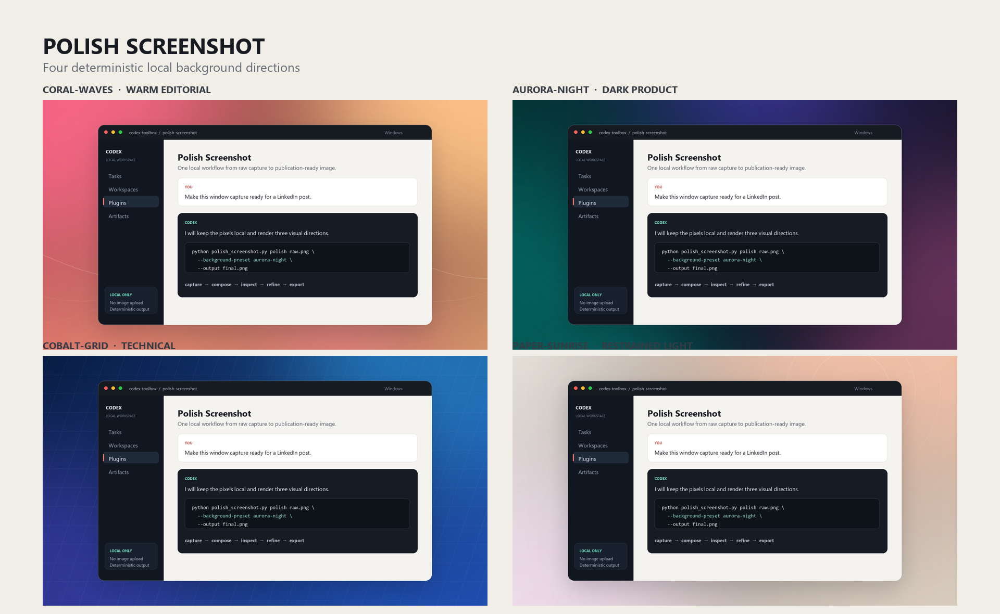

# Polish Screenshot for Codex

[](LICENSE)
[](skills/polish-screenshot/SKILL.md)

Polish Screenshot turns a raw window or application capture into a publication-ready composition. It adds reusable local backgrounds, balanced padding, restrained rounded corners, a subtle border, and a soft two-layer shadow.

The workflow runs locally. It does not send screenshots to a rendering service.



## What it does

- Polishes PNG, JPEG, and WebP screenshots with one deterministic Python CLI.
- Includes four contrasting background presets and supports custom colors or images.
- Generates reusable background PNG files at any canvas size.
- Guides Codex through capture, visual inspection, correction, and export.
- Keeps sensitive screenshot content on the local machine.

## Install

Add Codex Toolbox and install the plugin:

```bash
codex plugin marketplace add Hector-Touza/codex-toolbox --ref main
codex plugin add polish-screenshot@codex-toolbox
```

Install the runtime dependency:

```bash
python -m pip install "Pillow>=10"
```

## Use

Invoke the skill as `$polish-screenshot`, or run its CLI from this plugin directory:

```powershell
python skills/polish-screenshot/scripts/polish_screenshot.py polish `
  examples/sample-window.png `
  --output polished-window.png `
  --canvas 1536x864 `
  --background-preset aurora-night
```

List or render the supplied backgrounds:

```powershell
python skills/polish-screenshot/scripts/polish_screenshot.py presets
python skills/polish-screenshot/scripts/polish_screenshot.py backgrounds `
  --output-dir backgrounds
```

## Presets

| Preset | Direction |
| --- | --- |
| `coral-waves` | Warm editorial color with quiet flowing lines. |
| `aurora-night` | Dark developer-focused field with colored light. |
| `cobalt-grid` | Structured blue technical treatment. |
| `paper-sunrise` | Understated light composition with warm color. |

Use `--background-image` for a brand asset or `--background-color` for a strict solid color. Canvas, padding, radius, shadow blur, shadow opacity, and export quality are configurable.

## Requirements and limitations

- Python 3.10 or newer.
- Pillow 10 or newer.
- The CLI composes an existing screenshot; it does not capture arbitrary desktop windows itself.
- The skill can guide native Windows window capture or use a browser/app screenshot tool when one is available.
- Always inspect the final image. Small interface text can become unreadable when the source window is too large for the chosen canvas.

## License

[MIT](LICENSE) © 2026 Hector Touza.
